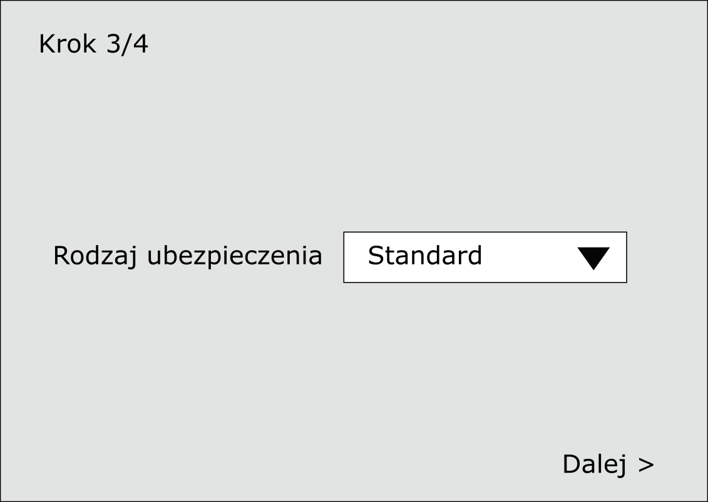
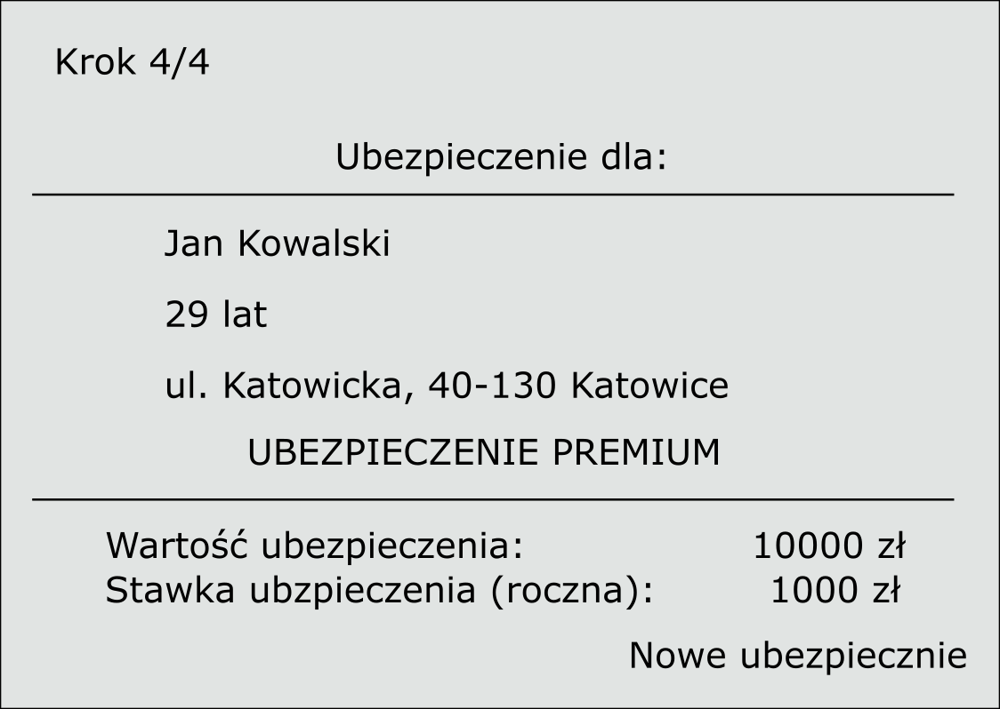

# 430-PHP-data

### Image
```php


$startX = 100;
$startY = 100;
$koniecX = 200;
$koniecY = 200;

ImageRectangle($obrazek, $startX, $startY, $koniecX, $koniecY, $czarny);
ImageFilledRectangle($obrazek, $startX, $startY, $koniecX, $koniecY, $czarny);

```

### Email
```php
<?php

$od  = "From: uzytkownik@kursphp.com \r\n";
$od .= 'MIME-Version: 1.0'."\r\n";
$od .= 'Content-type: text/html; charset=iso-8859-2'."\r\n";
$adres = "przyklad@uzycia.pl";
$tytul = "Tytuł wiadomości";
$wiadomosc = "<html>
<head>
</head>
<body>
   <b>Witam serdecznie!</b><br/>
   Zapraszam na stronę: <a href="https://kursphp.com">Kurs PHP</a>   
</body>
</html>";

// użycie funkcji mail
mail($adres, $tytul, $wiadomosc, $od);

?>
```

<!--

### Zadania

ZAD43001 
Przygotuj aplikację pobierającą dane osobowe w celu dokonania kalkulacji ubezpieczenia zdrowotnego od użytkownika a na końcu zapisz/dodaj do pliku podsumowanie.
- Pobieranie danych obywa się w czterech krokach:
  1. dane osobowe (imię i nazwisko, email, wiek);
     
  3. adres;
     
  5. Wybór typu ubezpieczenia (standard, premium)
     
  6. Wyświetlenie podsumowania wraz z zapisem/dodaniem do pliku
     
- Kalkulacja wysokości ubezpieczenia odbywa się poprzez pomnożenie stawki 100 000 zł * wiek / 20
- Stawka ubezpieczenia to iloraz wartości ubezpieczenia i liczby 100

  -->

### Info
https://kursphp.com/nauka-php-online/
